 

# EPC9137 1.5 kW 48V/12V Bi-directional Power Module Evaluation Board Firmware

- - -

### 2-Phase Synchronous Buck Converter with Bi-Directional Current Mode Control and Current Balancing

<table style="border: none; align:center; width:100%">
<tr>
 <td style="align:center;"> &nbsp; </td>
 <td style="text-align:center; vertical-align: bottom; height:360px; width:300px;"> 
    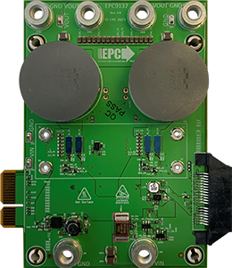 
 </td>
 <td style="align:center; width:10px"> &nbsp; </td>
 <td style="text-align:center; vertical-align: bottom;"> 
    <table style="border: none; align:center; width:300px">
    <tr>
    <td style="text-align:center; vertical-align:bottom; width:300px">
    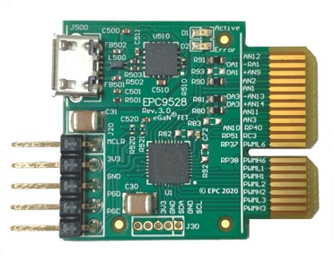 <br>
    <p style="font-size:14px;">Top View</p>
    </td>
    </tr>
    <tr>
    <td style="text-align:center; vertical-align: bottom; width:300px">
    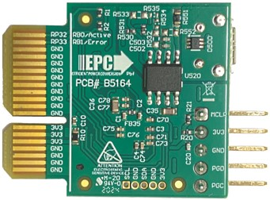 <br>
    <p style="font-size:14px;">Bottom View</p>
    </td>
    </tr>
    </table>
</td>
 <td style="align:center;"> &nbsp; </td>
</tr>
<tr>
 <td style="align:center;"> &nbsp; </td>
 <td align=center> <b>EPC9137 Power Module</b> </td>
 <td style="align:center;"> &nbsp; </td>
 <td align=center> <b>EPC9528 Controller Card</b></td>
 <td style="align:center;"> &nbsp; </td>
</tr>
<tr>
<td align=center colspan="5">
<p style="font-size:14px;">
<a target="_blank" href="https://www.microchip.com/EPC9137" rel="nofollow">
1.5 kW 48V/12V Bi-directional Power Module (Part-No. EPC9137)  <br> with Processor Plug-In Card (Part-No. EPC9528)
</a>
</p>
</td>
</tr>
</table>

- - -

<span id="startDoc"><a name="startDoc"></a></span> <!-- start tag for internal references supported by Bitbucket, Github and Visual Studio Code -->

## Table of Contents

- [Summary](#summary)
  - [Related Documentation](#docs)
  - [Development Tools](#devtools)
- [Security and Safety Requirements](#safety)
- [Demo Setup](#setup)
  - [Heatsink Assembly](#heatsink)
  - [Buck Mode Operation](#buckmode)
  - [Boost Mode Operation](#boostmode)
  - [4-Phase Operation](#4phasemode)
  - [Loop Test Operation](#looptest)
- [Firmware Quick-Start Guide](#fwqsg)
  - [Buck Converter State Machine](#fwqsg)
  - [Cycle-by-Cycle Current Mode Control Loop](#control)
  - [User Control Interface](#usrctrl)
- [Special Features](#planttf)
  - [Power Plant Measurement Support](#planttf)

- - - 
<span id="summary"><a name="summary"> </a></span>

## Summary

This code example demonstrates a closed loop current mode control implementation for dsPIC33CK. It has been specifically developed for the EPC9137 1.5 kW Bi-Directional 48V-to-12V power module, hardware revision 4.0 (see 'Rev' number printed on board top view shown above for verification).

<center>
<iframe width="560" height="315" src="https://www.youtube-nocookie.com/embed/rXREE3YrfNY" title="YouTube video player" frameborder="0" allow="accelerometer; autoplay; clipboard-write; encrypted-media; gyroscope; picture-in-picture" allowfullscreen>
</iframe>
<p style="font-size:14px;">Bidirectional 1.5 kW 48-to-12V Bus Converter Introduction</p>
</center>

<details><summary>Read more...</summary>

The board starts up automatically when a voltage between defined minimum and maximum input voltage is applied across the 48V-input terminals of the board, providing a regulated output voltage of 12 V DC at the output terminals of the converter. The startup procedure is controlled and executed by the power controller state machine and includes a configurable startup procedure with power-on delay, ramp-up period and power-good delay before dropping into constant regulation mode.

#### Fault Management

An additional fault handler routine continuously monitors incoming ADC data and peripheral status bits and shuts down the power supply if

- the input voltage is outside the defined maximum range (UVLO/OVLO)
- the output voltage is more than 0.5 V out of regulation for more than 25 milliseconds
- the heat-sink base temperature exceeds 95°C (OTP)
- the total output current exceeds 130 A (buck mode) resp. 35 A (boost mode)

The converter automatically recovers from all detected fault conditions listed above.

#### Product Features

- Input Voltage: 17 V to 64 V DC
- Output Voltage: 12.0 / 13.2 V DC (12 V default setting)
- Switching Frequency: 250 kHz
- Control Frequency: 250 kHz
- Cross-Over Frequency: ~5 kHz
- Phase Margin: ~ 60°
- Gain Margin: ~ 12 dB

</details>

[[back](#startDoc)]
- - -
<span id="docs"><a name="docs"> </a></span>

## Related Documentation

##### Firmware Documentation

- EPC9137 Online Firmware Documentation (coming soon)

##### Hardware Documentation

- [EPC9137 300W 1/16th brick Power Module Reference Design Product Website](https://www.microchip.com/DevelopmentTools/ProductDetails/PartNO/EPC9137)
  - [EPC9137 Reference Design Quick Start Guide (QSG)](https://epc-co.com/epc/documents/guides/EPC9137_qsg.pdf)
  - [EPC9137 Reference Design Schematics](https://epc-co.com/epc/documents/schematics/EPC9137_Schematic.pdf)
  - [EPC9528 Controller Card Quick Start Guide (QSG)](https://epc-co.com/epc/documents/guides/EPC9528_qsg.pdf)
  - [EPC9528 Controller Card Schematics](https://epc-co.com/epc/documents/schematics/EPC9528_Schematic.pdf)

##### Device Support

*Featured Microchip Technology Products:*

- [dsPIC33CK256MP503 Product Website](https://www.microchip.com/dsPIC33CK32MP503)
  - [dsPIC33CKxxMP50x Device Family Data Sheet](https://www.microchip.com/DS70005349)
  - [dsPIC33CKxxMP50x Device Family Silicon Errata and Data Sheet Clarification](https://www.microchip.com/DS80000796)
  - [Functional Safety Ready dsPIC33 and PIC24 Microcontrollers](https://www.microchip.com/DS90003249)
- [MCP6C02 Shunt Amplifier Product Website](https://www.microchip.com/MCP6C02)
  - [MCP6C02 Zero-Drift, High-Side Current Sense Amplifier](https://www.microchip.com/DS20006129)
- [MCP2221A USB 2.0 to I2C/UART Protocol Converter Product Website](https://www.microchip.com/MCP6C02)
  - [MCP2221A Protocol Converter Data Sheet](https://www.microchip.com/DS20005565)

*Featured Efficient Power Conversion (EPC) Products:*

- [EPC2206 80 V, 90/396 A, AEC-Q101 Qualified Enhancement-Mode GaN Power Transistor](https://epc-co.com/epc/Products/eGaNFETsandICs/EPC2206.aspx)
  - [EPC2206 Data Sheet](https://epc-co.com/epc/Portals/0/epc/documents/datasheets/EPC2206_datasheet.pdf)

[[back](#startDoc)]
- - -
<span id="devtools"><a name="devtools"> </a></span>

## Development Tools

##### MPLAB® X Integrated Development Environment (IDE)

- [Requires MPLAB® X IDE, Version v5.40 or later](https://www.microchip.com/mplabx)
  - [Download latest version of MPLAB® X IDE for Windows](https://www.microchip.com/mplabx-ide-windows-installer)
  - [Download latest version of MPLAB® X IDE for Linux](https://www.microchip.com/mplabx-ide-linux-installer)
  - [Download latest version of MPLAB® X IDE for MAC OS](https://www.microchip.com/mplabx-ide-osx-installer)

##### MPLAB® XC16 C-Compiler

- [Requires MPLAB® XC16 Compiler, Version v1.50 or later](https://www.microchip.com/xc16)
  - [Download latest version of MPLAB® XC16 Compiler for Windows](https://www.microchip.com/mplabxc16windows)
  - [Download latest version of MPLAB® XC16 Compiler for Linux](https://www.microchip.com/mplabxc16linux)
  - [Download latest version of MPLAB® XC16 Compiler for MAC OS](https://www.microchip.com/mplabxc16osx)

##### MPLAB® X PowerSmart™ Digital Control Library Designer

- [Optional: PowerSmart&trade; - Digital Control Library Designer, v0.9.14 or later (Pre-Release Version)](https://microchip-pic-avr-tools.github.io/powersmart-dcld/)
  - [Download latest version of PowerSmart&trade; - DCLD for Windows](https://github.com/microchip-pic-avr-tools/powersmart-dcld/archive/release.zip)

##### Microchip Power Board Visualizer GUI Supporting dsPIC33&reg; DSCs

- [Optional: Power Board Visualizer Software](https://www.microchip.com/SWLibraryWeb/product.aspx?product=POWER_BOARD_VISUALIZER)
  - [Download Power Board Visualizer Software for Windows](https://ww1.microchip.com/downloads/en//softwarelibrary/power_board_visualizer/microchip%20power%20board%20visualizer%20installer%201.0.0.0.msi)

[[back](#startDoc)]
- - -
<span id="safety"><a name="safety"> </a></span>

## Security and Safety Requirements

Unattended operating power supplies are always a potential safety risk as short circuits or failures of power components can occur at any time where even seemingly small power converters can cause fire or damage connected equipment.

- This development board has not been FCC approved nor certified and must not be used outside a laboratory environment
- Never operate the board unattended
- Only use power supplies delivered with the board or equal, approved laboratory equipment
- Read the user guide for detailed operating instructions to prevent damage to the board or connected equipment

[[back](#startDoc)]
- - -


## Setup

The EPC9137/EPC9528 kit comes programmed **in buck mode** and ready to be used when unpacked. No reprogramming of the target device is required to operate the board unless features, modes or settings such as the nominal output voltage or start-up timing need to be modified.

The EPC9528 controller card must be plugged into the EPC9137 power module before power is applied to the development kit. The converter is starting up automatically when more than 17 V DC are applied across the 48V input terminals of the EPC9137 power module.

In case firmware based features or operating modes need to be changed, the Microchip dsPIC33CK controller can be re-programmed using the in-circuit serial programming port (ICSP) available on the 5-pin header provided on the EPC9528 Controller Card. This interface supports all of Microchip’s in-circuit programmers/debuggers, such as [MPLAB® ICD4](https://www.microchip.com/icd4), [MPLAB® REAL ICE](https://www.microchip.com/realice) or [MPLAB® PICkit4](https://www.microchip.com/pickit4) and previous derivatives.


**Please read the [EPC9528 Quick Start Guide](https://epc-co.com/epc/documents/guides/EPC9531_qsg.pdf)** to get detailed information about the requirements for setup and operation of this development kit.


<span id="heatsink"><a name="heatsink"> </a></span>

#### 1) Mounting the Heat Sink

If the heat sink has not been mounted yet, it is highly recommended to assemble it before high power test procedures are performed. Without heat sink there is a high risk of thermal overstress, shortening the lifetime of the development kit and baring the risk of irreversible damage.

<p>
  <center>
    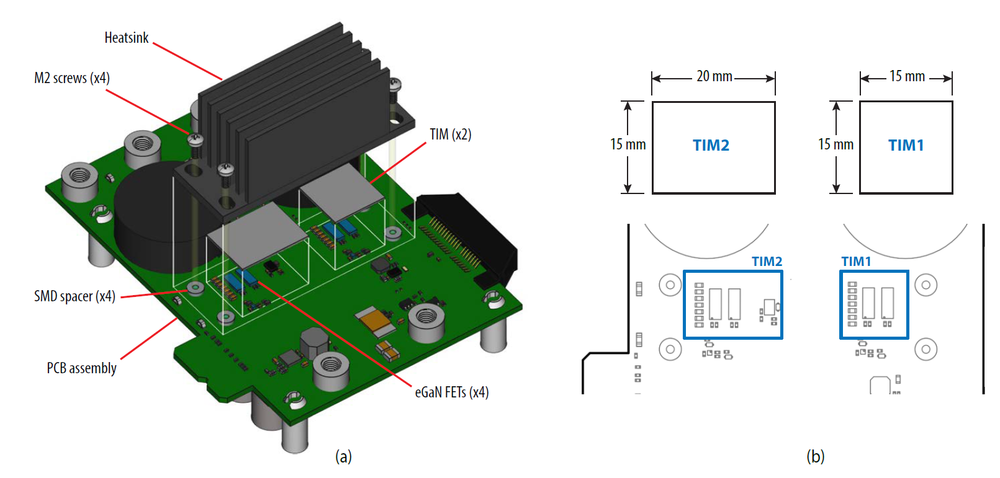
    <br>
    <p style="font-size:14px;">EPC9137 Heat Sink Assembly</p>
  </center>
</p>

Please read the user guide for more detailed instructions on the proper mounting procedure.

[[back](#startDoc)]
- - -
<span id="buckmode"><a name="buckmode"> </a></span>

#### 2) Buck Mode Operation

**This is the default setup supported by the firmware provided.** When connected to a DC bench supply and load, this kit can be operated as standard, fixed output voltage 48V-to-12V step down converter. If the output is driven into current limit at 125 A of output current, the converter will drop into constant current mode until the output voltage drops below 7V.

<p>
  <center>
    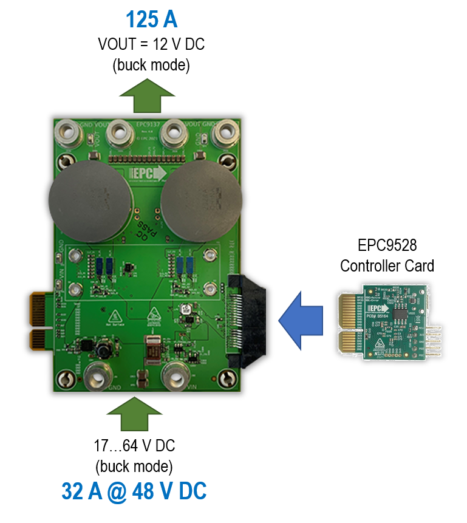
    <br>
    <p style="font-size:14px;">EPC9137 Buck Mode Setup</p>
  </center>
</p>

##### ELECTRICAL PERFORMANCE / TEST RESULTS

Test Conditions: VIN = 48 V DC

<details><summary>Show Details...</summary>

<table style="border: none; align:center; width:100%">
<tr>
  <td style="align:center;"> &nbsp; </td>
  <td style="text-align:center; vertical-align: bottom;"> 
  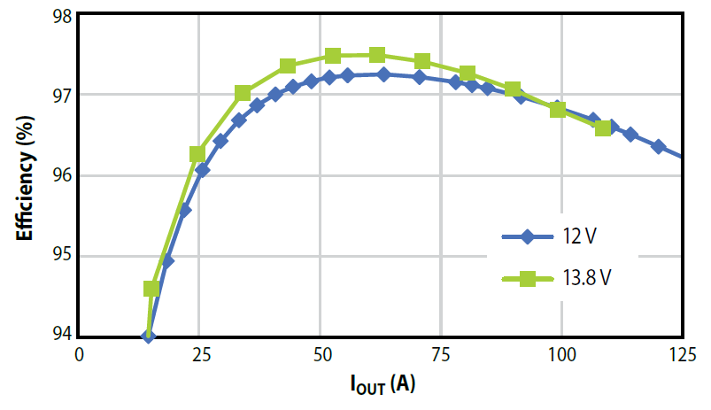 
  </td>
  <td style="text-align:center; vertical-align: bottom;"> 
  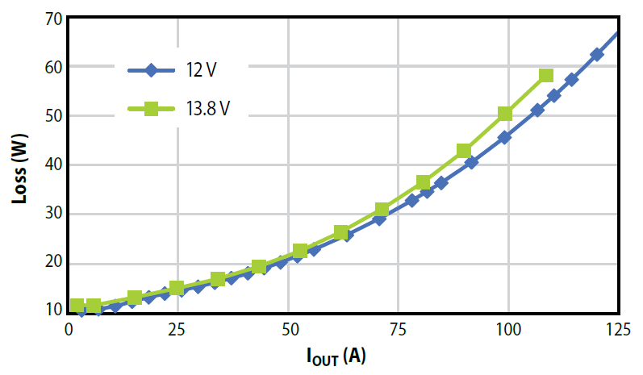 
  </td>
  <td> &nbsp; </td>
</tr>
<tr>
  <td style="align:center;"> &nbsp; </td>
  <td style="text-align:center; font-size:14px; vertical-align: bottom; height:10px;"> 
    EPC9137 Buck Mode Efficiency
  </td>
  <td style="text-align:center; font-size:14px; vertical-align: bottom;"> 
    EPC9137 Buck Mode Losses
  </td>
  <td> &nbsp; </td>
</tr>
<tr>
  <td colspan=4 style="align:center; height:8pt;"> </td>
</tr>
<tr>
  <td style="align:center;"> &nbsp; </td>
  <td style="text-align:center; vertical-align: bottom;"> 
  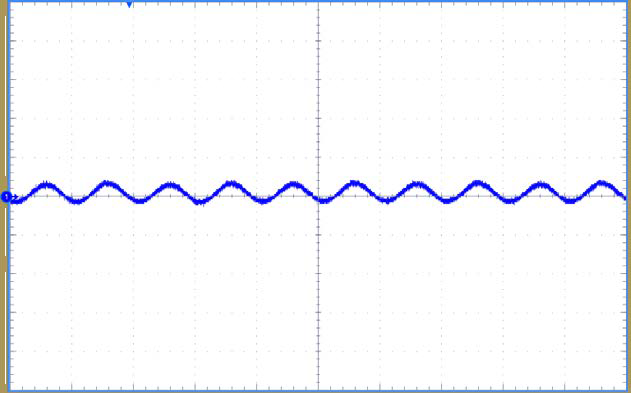 
  </td>
  <td style="text-align:center; vertical-align: bottom;"> 
  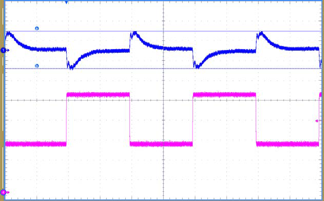 
  </td>
  <td> &nbsp; </td>
</tr>
<tr>
  <td style="align:center;"> &nbsp; </td>
  <td style="text-align:center; font-size:14px; vertical-align: bottom; height:10px;"> 
    EPC9137 Buck Mode Output Voltage Ripple <br>
    (2 µs/div, 100 mV/div)
  </td>
  <td style="text-align:center; font-size:14px; font-size:14px; vertical-align: bottom;"> 
    EPC9137 Buck Mode Transient Response @ VOUT = 12 V<br>
    [<span style="color:#0066ff"> VOUT </span>, <span style="color:#ff00ff">IOUT</span>]
    (2 ms/div, 500 mV/div, 6 A/div)
  </td>
  <td> &nbsp; </td>
</tr>
<tr>
  <td colspan=4 style="align:center; height:8pt;"> </td>
</tr>
<tr>
  <td style="align:center;"> &nbsp; </td>
  <td colspan=2 style="text-align:center; vertical-align: bottom;"> 
  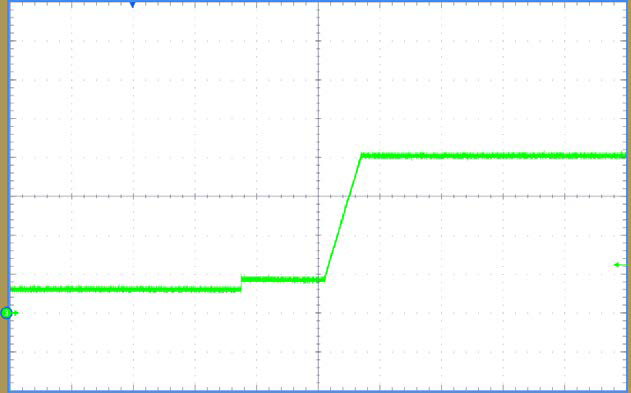 
  </td>
  <td> &nbsp; </td>
</tr>
<tr>
  <td style="align:center;"> &nbsp; </td>
  <td colspan=2 style="text-align:center; font-size:14px; vertical-align: bottom; height:10px;"> 
    EPC9137 Buck Mode Output Voltage Startup Timing <br>
    (100 ms/div, 3 V/div)
  </td>
  <td> &nbsp; </td>
</tr>
</table>

</details>

[[back](#startDoc)]
- - -
<span id="boostmode"><a name="boostmode"> </a></span>

#### 3) Boost Mode Operation

In boost mode, the converter starts up as soon as input voltage between 9 V DC and 18 V DC is applied to the 12 V DC terminals of EPC9137.

<p>
  <center>
    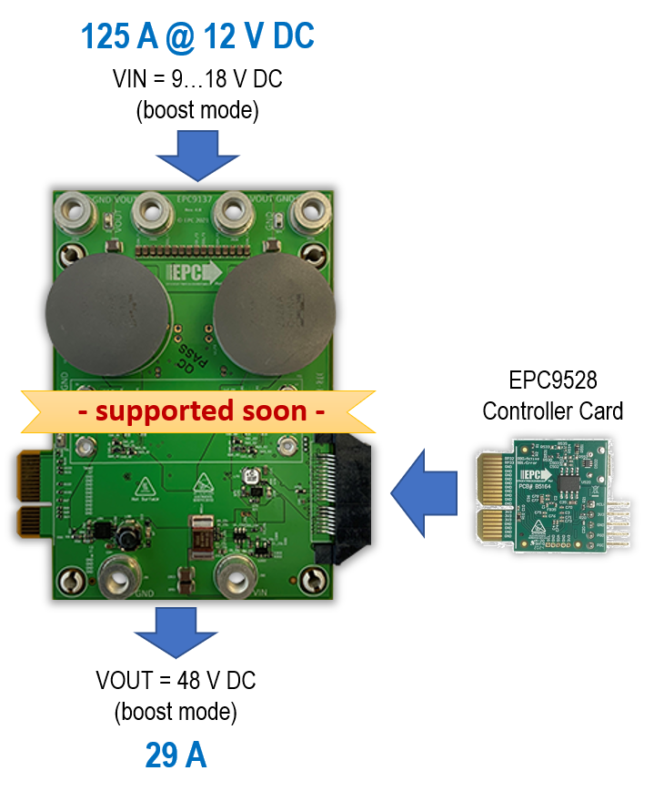
    <br>
    <p style="font-size:14px;">EPC9137 Boost Mode Setup</p>
  </center>
</p>

##### ELECTRICAL PERFORMANCE / TEST RESULTS

Test Conditions: VIN = 12 V DC

<details><summary>Show Details...</summary>

*(test results not available in this firmware release)*

</details>

[[back](#startDoc)]
- - -
<span id="4phasemode"><a name="4phasemode"> </a></span>

#### 4) 4-Phase Operation

The EPC9137/EPC9528 kit allows paralleling of up to two EPC9137 power modules controlled by one EPC9528 controller card. In this configuration the kit can provide up to 250 A of output current (= 3 kW @ VOUT = 12 V DC).

<p>
  <center>
    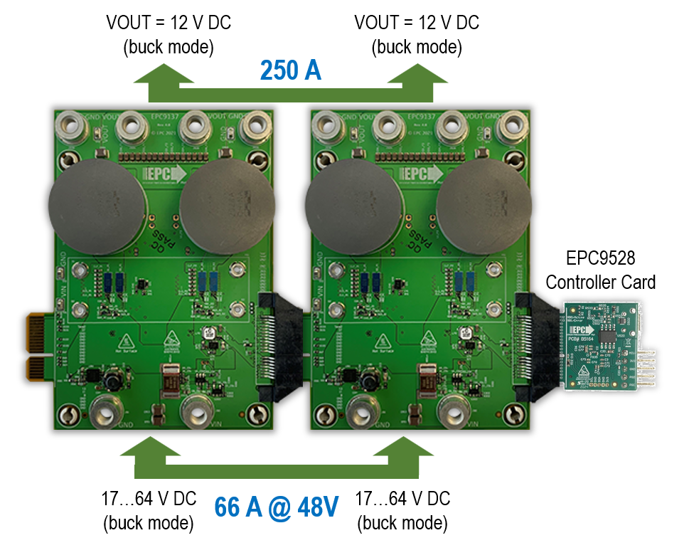
    <br>
    <p style="font-size:14px;">EPC9137 4-Phase Converter Setup</p>
  </center>
</p>

##### ELECTRICAL PERFORMANCE / TEST RESULTS

Test Conditions: VIN = 48 V DC

<details><summary>Show Details...</summary>

*(test results not available in this firmware release)*

</details>

[[back](#startDoc)]
- - -
<span id="looptest"><a name="looptest"> </a></span>

#### 5) Loop Test Operation

To simplify test procedures and allow long-term testing with reduced power consumption, two EPC9137/EPC9528 kits can be operated in counter-wise step-down/step-up mode, effectively circling power through both converters. Due to the inevitable power losses, an  additional auxiliary power supply (e.g. bench power supply) must be connected to either 48 V- or 12 V-rail side to keep the operation going. It is recommended to buffer both bus rails with larger off-board capacitors to balance the 12 V versus the 48 V bus.

<p>
  <center>
    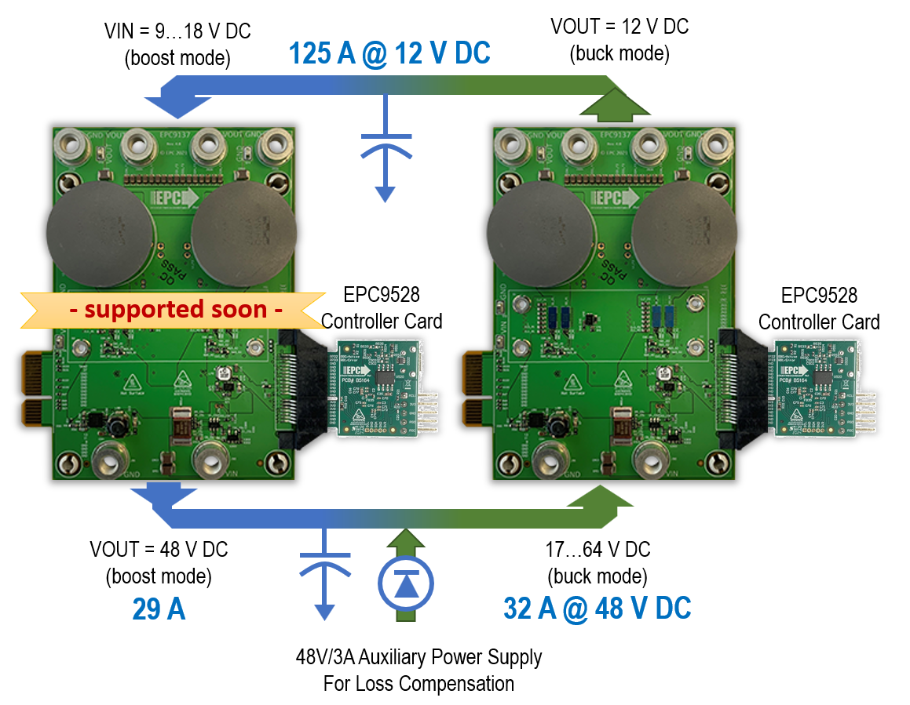
    <br>
    <p style="font-size:14px;">EPC9137 Loop Test Mode Setup</p>
  </center>
</p>

##### ELECTRICAL PERFORMANCE / TEST RESULTS

Test Conditions: VIN = 48 V DC

<details><summary>Show Details...</summary>

*(test results not available in this firmware release)*

</details>

[[back](#startDoc)]
- - -
<span id="fwqsg"><a name="fwqsg"> </a></span>

## Firmware Quick-Start Guide

#### 1) Buck Converter State Machine

<details><summary>Show details...</summary>

The state machine goes through the following steps in chronological order:

##### a) Initialization

In this step the control loop parameters are reset to their defaults, PWM outputs are turned off but the PWM generators are still running, continuously triggering the ADC sampling input and output voltage as well as board temperature.

##### b) Reset

This is the 'fall-back' state from which the buck converter will be restarted once it has been started successfully and has been shut down due to a fault condition (e.g. input under/over voltage or over temperature condition)

##### c) Standby

After `RESET`, the state machine waits for all fault flags to be cleared and the `ENABLE` and `GO` bits to be set.

##### d) Power-On Delay (POD)

Once the buck converter has been cleared the state machine will execute the startup procedure starting with the Power On Delay. This is just a simple delay during which the converter will remain inactive but the fault handler will observe the values generated by the ADC for occurring fault conditions.

##### e) Launch Voltage Ramp

After the Power-On delay has expired, input and output voltage will be measured. In case the converter output is pre-biased (voltage = non-zero), the power controller will be 'pre-charged' with an artificial control history and PWM output to softly ramp up the output voltage from its most recent level.

##### f) Voltage Ramp-Up

Now the digital feedback loop and PWM are enabled and the closed loop system reference value is incremented with every execution of the state machine (100 µsec interval). The control loop has been adjusted to operate with a cross-over frequency of >10 kHz matching the maximum perturbation frequency allowed to keep the control system stable.  

##### g) Power Good Delay

After the reference voltage has been increased to the pre-defined nominal level, the state machine switches over into the Power Good Delay period. This is another, simple delay where the control loop is in steady state waiting for the delay period to expire.

##### h) Online

After the Power Good Delay has expired, the converter drops into nominal operation. In this condition it continuously observes the reference value for changes. Should any other part of the firmware change the controller reference, the state machine will softly tune into the new level instead of hard-switching the reference.

##### i) Suspend/Error

If the power controller is shut down and reset by external commands (e.g. fault handler detecting a fault condition or through user-interaction), the state machine is switching into the `SUSPEND` state, which disables the PWM outputs and control loop execution, clears the control histories and resets the state machine back to `RESET`

</details>

[[back](#startDoc)]
- - -
<span id="control"><a name="control"> </a></span>

#### 2) Cycle-by-Cycle Current Mode Control Loop

<details><summary>Show details...</summary>

The bi-directional control system of EPC9137 is based on the conventional Average Current Mode Control (ACMC). An outer voltage loop regulates the output voltage by comparing the most recent feedback value against an internal reference. The deviation is processed by a discrete type II (2P2Z) compensation filter. The output of the voltage loop sets the reference for the two inner current loops. Each phase current controller processes the deviation between the given dynamic current reference and the individual most recent current feedback. Each current control loop output adjusts the individual duty cycle or phase resulting in tightly balanced phase currents. This control scheme is applied to both, 48 V to 12 V downstream buck as well as to 12 V to 48 V upstream boost operation.

When powered from a single DC source from either side of the converter, the output voltage will be kept constant up to the maximum output current of 125 A in buck, respectively 29 A in boost operation, at which point the converter switches into constant current regulation, effectively disabling the voltage regulation.

This firmware serves as the fundamental building block of battery charging bus balancer systems by implementing an optional, chemistry-specific charging profile balancing between two battery powered bus rails.


<p>
  <center>
    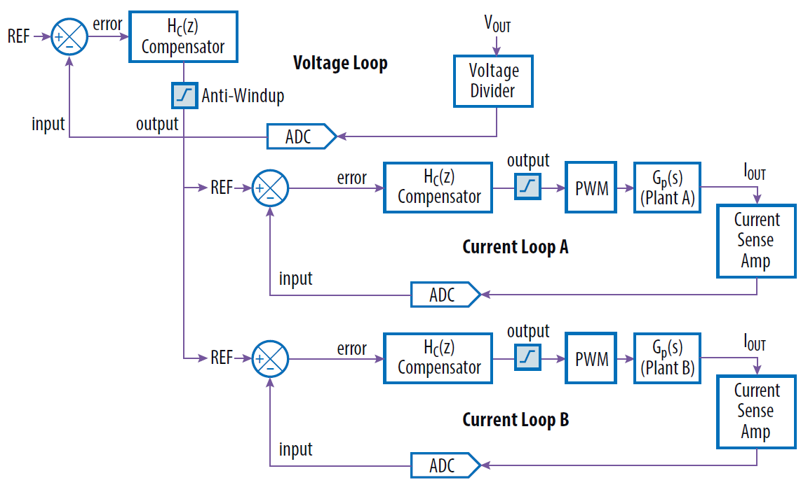
    <br>
    EPC9137 Average Current Mode Control Loop
  </center>
</p>

This control loop can be turned on/off by using the ENABLE bit in the STATUS word of the cNPNZ_t controller data structure. The control loop source code is generated and configured by the PowerSmart&trade; - Digital Control Library Designer (PS-DCLD) software.

This additional design software is available for download on Github Pages:

- [PowerSmart&trade; Digital Control Library Designer Github Page](https://microchip-pic-avr-tools.github.io/powersmart-dcld/)

Once installed, the controller configuration can be modified. The most recent configuration can be opened from within the MPLAB X® IDE by right-clicking on the file **'v_loop.dcld'** for the outer voltage loop configuration, resp. **'i_loop.dcld'** for the inner current loop, located in the Important Files folder of the Project Manager. When right-clicked, select **'Open In System'** to open the configuration in PowerSmart&trade; DCLD.

Please refer to the user guide of PowerSmart&trade; DCLD which is included in the software and can be opened from the help menu of the application.

</details>

[[back](#startDoc)]
- - -
<span id="usrctrl"><a name="usrctrl"> </a></span>

#### 3) User Control Interface

<details><summary>Show details...</summary>

No user control interface has been added to the firmware. Any change to the firmware and fundamental operation of the reference design, including reprogramming of the nominal output voltage can be done by editing the hardware-specific values in the hardware description header file 'epc9137_r40_hwdescr.h' located in 'Project Manager => Header Files/Config'

Converter settings in this file are defined as physical quantities such as Volt, Ampere, Ohm, etc. Each defined value is converted into binary numbers by so-called macros, at compile time. Thus, users do not have to convert values manually.

##### Example:
To program the converter to provide a nominal output voltage different from the 12 V DC set by default, follow these steps:

- Open the project in MPLAB X® IDE
- Navigate to 'Header Files/Config/epc9137_r10_hwdescr.h' using the Project Manager on the left side of the main window
- Search for marco `BUCK_VOUT_NOMINAL` (see below)
- Change the give settings as desired
- Build the program
- Remove power from the input of the EPC9528 Controller Card
- Connect a valid ICSP programming device (e.g. MPLAB ICD4, MPLAB PICkit4) to the PC and the EPC9528 Controller Card (see EPC9528 Quick Start Guide for details)
- Program the device with the target device being powered by the debugger/programmer
- Disconnect the ICSP programming device from the EPC9528 Controller Card
- Apply valid input voltage across the input terminals and observe the output of the EPC9137 power module

The setting for the nominal output voltage is found in the output voltage parameters declaration section.

```c
  #define BUCK_VOUT_NOMINAL           (float)12.000  // Nominal output voltage
  #define BUCK_VOUT_TOLERANCE_MAX     (float)0.500   // Output voltage tolerance [+/-]
  #define BUCK_VOUT_TOLERANCE_MIN     (float)0.100   // Output voltage tolerance [+/-]
```

##### Please note

The tolerance settings above include the transient response at a maximum load step. The value for maximum output voltage tolerance `BUCK_VOUT_TOLERANCE_MAX` is observed by the fault handler. Should the output voltage reading divert from the most recent reference voltage value by more than the given range, the converter will be shut down and a `REGULATION ERROR` will be indicated. The power supply will automatically recover as soon as the fault condition has been cleared and the recover delay period specified by `BUCK_REGERR_RECOVERY_DELAY`, declared in the EPC9137 hardware description header file, has expired.

</details>

[[back](#startDoc)]
- - -
<span id="planttf"><a name="planttf"> </a></span>

#### 4) Power Plant Measurement Support

<details><summary>Show details...</summary>

This code examples includes an alternative, proportional control loop which is commonly used during measurements of the frequency response of the power plant. When the following define is set to TRUE, the common main control loop is replaced by the proportional controller.

```c
epc9137_r40_hwdescr.h:   #define PLANT_MEASUREMENT   false
```

##### PLEASE NOTE

PROPORTIONAL CONTROLLERS ARE BY DEFAULT UNSTABLE AND NOT SUITED TO REGULATE THE OUTPUT OF A POWER SUPPLY UNDER NORMAL OPERATING CONDITIONS. DURING A PLANT MEASUREMENT IT IS MANDATORY THAT INPUT VOLTAGE AND LOAD REMAIN STABLE AND DO NOT CHANGE.

FOR MORE INFORMATION ABOUT HOW TO CONDUCT A POWER PLANT MEASUREMENT, PLEASE READ THE SECTIONS IN THE PowerSmart™ DCLD USER GUIDE.

</details>

[[back](#startDoc)]
- - -
&copy; 2021, Microchip Technology Inc.
